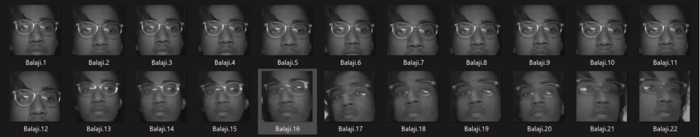
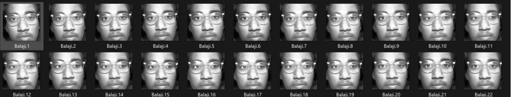
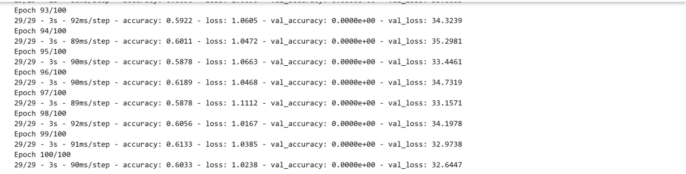

# Face Recognition using CNN
 A Face recongnition system which uses CNN(Convolutional Nueral Networks) to identify and recognize faces. It uses a large sample class for training the custom CNN model and uses LDA(Linear Discriminant Model) for extracting the features from the image to train the model. The model's performance is evaluated against KNN.

1. Dataset collection
Here, we used OpenCV to capture images through a webcam and implemented face detection using the Haar Cascade classifier (haarcascade_frontalface_default.xml). Once the face was detected, we cropped it, resized it to a standard size, converted it to grayscale, and stored the images. We collected 100 images for each individual to build the dataset.

2. Image Preprocessing:
Once the dataset was collected, we preprocessed the images to enhance their quality and prepare them for feature extraction and classification. The first step involved applying a bilateral filter to reduce noise while preserving edge details, which is crucial for maintaining facial features during face detection. Then, we converted the images to grayscale to simplify the data, as color information is not critical for face recognition. We also used histogram equalization to improve the contrast of the images, ensuring that the facial features are more pronounced. Finally, used Haar cascades again to detect faces in the preprocessed images and resized them to a uniform size (100x100 pixels) to ensure that all input data fed into the model was consistent.

3. Data Augmentation
We performed data augmentation on the collected dataset to enhance the model’s performance and reduce overfitting. Data augmentation is a critical step in deep learning as it artificially increases the size of the dataset by applying transformations like rotation, width and height shifting, zooming, shearing, and horizontal flipping. This approach helps the model generalize better, as it learns to recognize faces under different orientations and lighting conditions. We generated 10 augmented images for each original image, significantly expanding the dataset from 100 images per person to 1,000. This enriched dataset was essential for training a more robust and accurate model.

4. Feature Extraction Using LDA (Linear Discriminant Analysis):
For feature extraction, we applied Linear Discriminant Analysis (LDA) to reduce the dimensionality of the image data while retaining the most important features that distinguish one class (person) from another. We first flattened the images (converted them into 1D vectors) so that each image could be represented as a sample in a high-dimensional feature space. LDA finds a lower-dimensional space where the different classes (faces of different individuals) are as separable as possible. By reducing the number of dimensions, LDA not only improves computational efficiency but also helps in reducing the risk of overfitting, as it keeps only the most discriminative features of the faces. This step was performed on both the original dataset and the augmented dataset to see how the additional images affected the feature extraction and classification accuracy.

5. Classification Using KNN (K-Nearest Neighbors):

After feature extraction, We used the K-Nearest Neighbors (KNN) algorithm for classification. KNN is a simple but effective algorithm for classifying images based on the distances between data points in feature space. We set the number of neighbors (k) to 3, meaning the algorithm would look at the 3 nearest data points (images) in the LDA-transformed space and assign the class label based on the majority vote. KNN does not require training in the traditional sense it simply memorizes the dataset and performs classification by comparing the test data with the labeled training data. Initially, We applied KNN on the dataset with 100 images per person. To improve the accuracy,we then retrained the KNN classifier on the augmented dataset, which had 1,000 images per person. This significantly improved the classification results, as the model was exposed to a larger variety of images.

8. CNN (Convolutional Neural Network):

In addition to the KNN classifier, we implemented a Convolutional Neural Network (CNN) to directly perform feature extraction and classification in an end-to-end manner. CNNs are particularly well-suited for image recognition tasks because they automatically learn spatial hierarchies of features from the raw pixel data through layers of convolution and pooling. My CNN architecture consisted of several convolutional layers followed by max-pooling layers, which progressively extracted features like edges, textures, and patterns from the images. After the convolutional layers, we flattened the feature maps and passed them through fully connected layers for final classification. The final output layer used the softmax activation function to assign probabilities to each class (person). We trained the CNN on 1,600 images and tested it on 400 images to evaluate its performance. With 12 epochs of training, the CNN demonstrated strong classification accuracy, showing that it could recognize faces with minimal preprocessing and feature engineering.

The development and implementation of a facial recognition attendance system showcased the potential of biometric technology for streamlining attendance tracking. By leveraging techniques like data augmentation, LDA for feature extraction, and classification models such as KNN and CNN, the system achieved a balance between efficiency and accuracy. While CNN demonstrated superior performance due to its ability to learn complex patterns, challenges such as handling pose variations, lighting inconsistencies, and side profiles were evident.